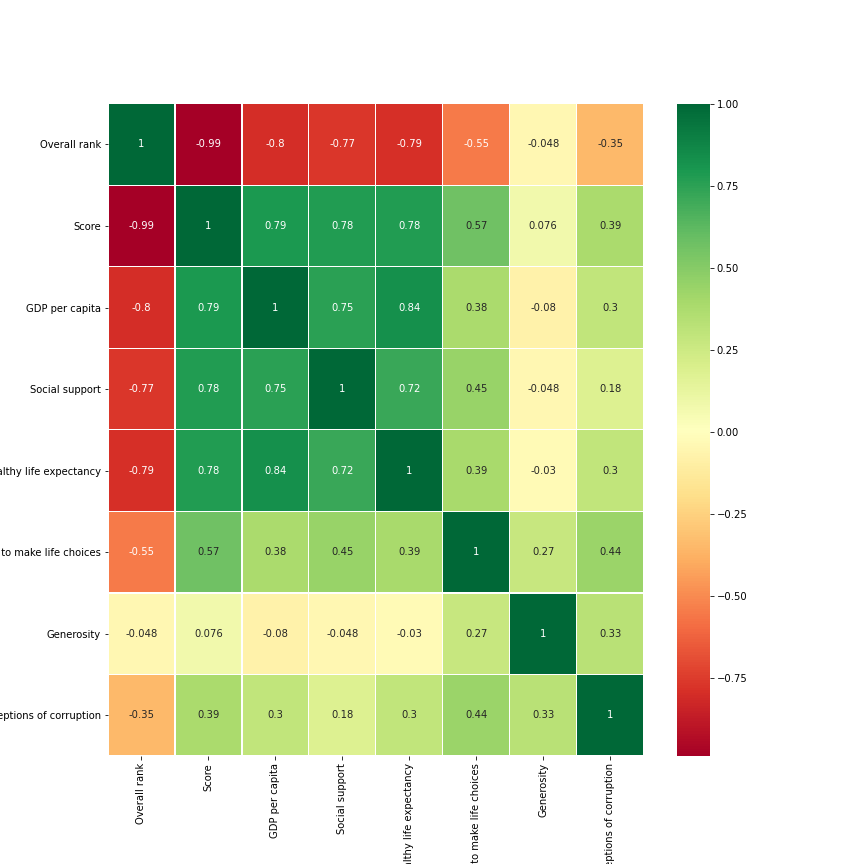

# Как посмотреть корреляцию в датасете за 5 минут!

## Статичный график для дальнейшего изучения или редактирования.

**В репозитории лежит тетрадь jupiter(_Correlatons.ipynb_) с кодом и построчными комментрариями!**

Будем делать график на **Python** и использовать библиотеки **Pandas**, **Seaborn** и **Matplotlib**

Известный датасет с Кегла. Всемирный доклад о счастье, 2019 год

https://www.kaggle.com/unsdsn/world-happiness?select=2019.csv

**Все действия и комментрарии в тетрадке!**